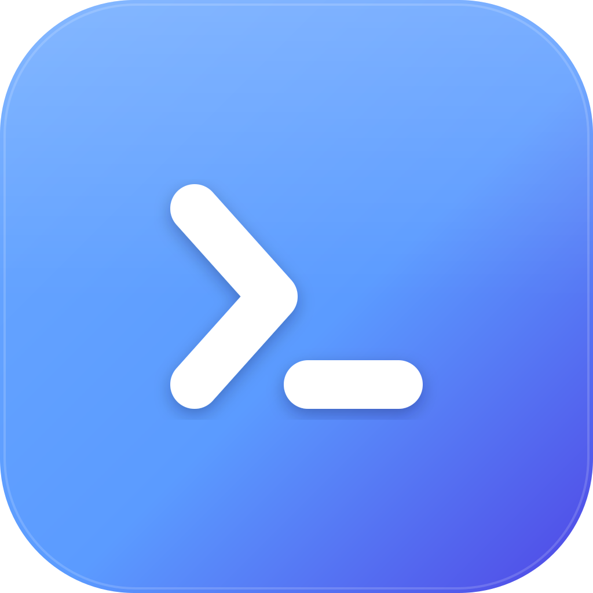
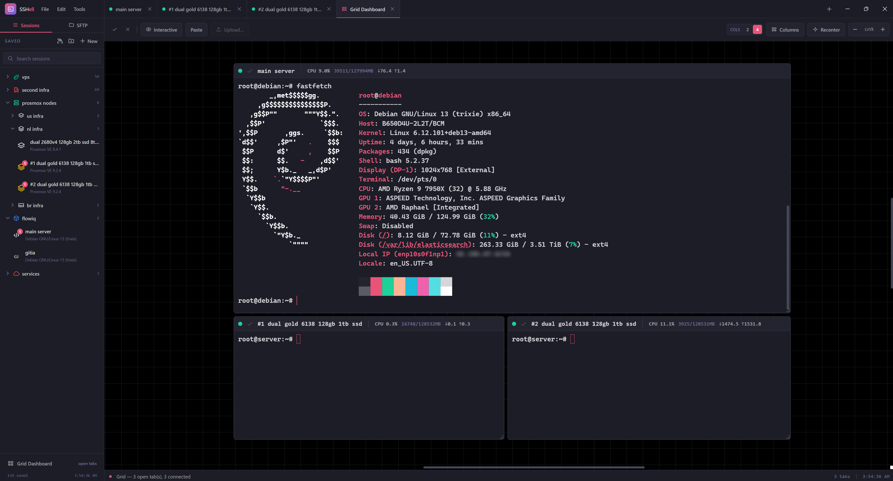

<div align="center">



# SSHell

**A modern, encrypted SSH session manager for the desktop.**

Tabbed terminals, a built-in SFTP client, a live server dashboard, a broadcast grid, and full theming — in one keyboard-friendly app.

[](LICENSE)


</div>

---



## Features

- **Tabbed terminals** — full xterm.js terminals with reconnect, per-tab menus, and drag-to-reorder.
- **Encrypted vault** — every session (passwords and key passphrases included) is stored with **AES‑256‑GCM**, keyed by **scrypt** from a master passphrase you set on first run. Nothing is written in the clear.
- **Trust-on-first-use host keys** — SSH host keys are verified and pinned like OpenSSH; you're warned loudly if a key ever changes.
- **SFTP file browser** — browse, upload, download, rename, delete, and "open with" your local editor (edits sync back). Transfers run on their **own SSH connection** so a big upload never freezes your shell.
- **Live server dashboard** — CPU, memory, network, uptime, logged-in users, and disk shown live in the status bar for the active session.
- **Broadcast grid** — an infinite, zoomable canvas of your open sessions. Type once and broadcast to the servers you pick; bulk-upload files to many hosts at once.
- **Organize everything** — nested folders, multi-select, bulk open/delete, quick rename, and per-session icons and colors.
- **Full theming** — a built-in theme builder, plus resizable sidebar and status bar that remember their size.
- **Keyboard-first** — see the in-app **Keyboard Shortcuts** panel (Tools ▸ Keyboard Shortcuts).

## Security model

SSHell is a **local desktop app**, and the master passphrase protects your saved credentials **at rest**:

- The vault (`sessions.json`) is AES‑256‑GCM encrypted; the key is derived with scrypt and **held only as a wiped-on-exit buffer** — the passphrase itself is never retained.
- Viewing a stored password, or exporting the vault, requires re-entering the master passphrase.
- Host keys are pinned on first connect and re-verified every time.
- The packaged app disables DevTools and pins navigation to its own files.

It is **not** a defense against malware already running as your user — like any SSH client, once the vault is unlocked the credentials are in memory so the app can connect. Keep your machine and your master passphrase safe.

## Install

Grab the latest build from the [Releases](https://github.com/kaikesouthier/sshell/releases) page:

- **Windows** — `SSHell-<version>-x64-setup.exe` (installer) or `SSHell-<version>-x64-portable.exe` (no install).
- **Linux** — `SSHell-<version>-x64.AppImage` or the `.deb`.

## Build from source

Requires **Node.js 18+**.

```bash
git clone https://github.com/kaikesouthier/sshell.git
cd sshell
npm install

# Run it
npm start

# Build the stylesheet (only needed after changing styles)
npm run css

# Package installers
npm run dist          # Windows (nsis + portable)
npm run dist:linux    # Linux  (AppImage + deb)
```

Regenerate the app icons from `assets/logo.svg` after editing the logo:

```bash
npm run make-icons
```

## Where your data lives

SSHell stores its vault and settings in your OS application-data folder:

- **Windows** — `%APPDATA%\SSHell\`
- **Linux** — `~/.config/SSHell/`

You can relocate the data folder from **File ▸ Configuration**. If you forget your master passphrase there is **no recovery** — the data is encrypted; delete `sessions.json` to start over.

## Development

```bash
npm test    # runs the full suite (no app window needed)
```

The renderer is plain CommonJS modules under `src/`, with HTML partials in `views/` and styles in `assets/`. There is no bundler — modules load via `require()`. The test suite runs the real modules against stubs, so it's fast and needs no display.

| Path | What's there |
|------|--------------|
| `main.js` | Electron main process (window, IPC, navigation hardening) |
| `app.js` | Renderer entry point and global shortcuts |
| `src/` | Feature modules (tabs, sftp, grid, crypto, vault, …) |
| `views/` | HTML partials assembled at startup |
| `assets/` | Styles, the logo, and generated icons |
| `test/` | The automated suite (`npm test`) |
| `tools/` | The icon generator |

## Contributing

Issues and pull requests are welcome. Please run `npm test` before opening a PR, and keep the existing code style (the codebase favors small modules and comments that explain *why*, not *what*).

## License

[MIT](LICENSE) © Kaike Southier
